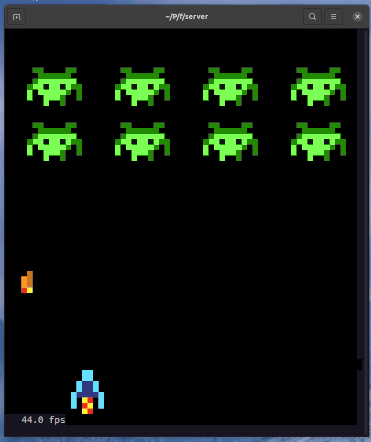

# The RGB Matrix Space Invaders

This project started during the 2020 Chrismas after I bought an RGB Matrix to play around. My goal with this game is to put the matrix in use and learn how to build a video game from scratch (without help of any framwork). You can also find this project with some more detailed instructions at [Make: Projects](https://makeprojects.com/project/led-space-invaders).


Running in the Raspberry Pi


Running in the command line



## Hardware

I'm not afiliated in any way with the following vendors. The links are added so you can find the hardware I got, feel free to buy your hardware at the vendor of your preference.

- [RGB Led Matrix](https://www.elektor.nl/joy-it-64x64-rgb-led-matrix-module)
- [Controller board for the RGB Led matrix](https://www.elektor.nl/joy-it-raspberry-pi-controllerboard-for-rgb-led-matrix)
- [Power supply for the RGB Led Matrix](https://etronixcenter.com/nl/led-transformatoren/8169311-sps36-nedro-dc5v-4a-20w-schakel-stroomadapter-driver-transformator-7110218614005.html)
- [Raspberry Pi 4](https://thepihut.com/products/raspberry-pi-4-model-b)
- USB Controller (Those generic that look like the old SuperNes controllers, I got them in a second hand shop)

As you can imagine, you need to connect everything together :-)

## Software

- Python 3
- RGB Led Matrix library (I used it check that the led matrix was working)
- The [flaschen-taschen](https://github.com/hzeller/flaschen-taschen) server
- Your favourite IDE. For this project I choose Visual Studio Code. In my daily programming life I use PyCharm, but I heard so many things about Code, that I thought that it was the perfect moment for checking new tools. Even I still feel more productive with PyCharm and I like more how it handles some things, I found quite handy the possiblity to develop remotely in my Raspberry from my laptop.

## Setting up things

### The Flaschen Taschen server

The RGB Matrix library needs to be run as root for accessing the timer of the Raspberry Pi (More [here](https://github.com/hzeller/rpi-rgb-led-matrix#running-as-root) [here](https://github.com/hzeller/rpi-rgb-led-matrix/issues/680) or [here](https://github.com/hzeller/rpi-rgb-led-matrix/issues/672)). I had problems to run the game as root and get access to the joystick, so I went with a solution proposed [here](https://github.com/hzeller/rpi-rgb-led-matrix/issues/672#issuecomment-408640514):

1. Start a server (as root) that will listen for specific messages and write the images into the screen
2. Run the game as no-root and send the sprites to the server

Some dependencies need to be fulfilled first:

```bash
sudo apt-get install libatlas-base-dev
```

Then the server can be cloned and built

```bash
git clone --recursive https://github.com/hzeller/flaschen-taschen.git
cd flaschen-taschen/server
make FT_BACKEND=rgb-matrix
```

The parameters for running the server may vary depending of the Raspberry that runs the software (see the parameter `--led-slowdown-gpio`) and the position of the RGB Matrix (see `--led-pixel-mapper`). The following parameters are for a 64x64 RGB Led Matrix running on a Raspberry Pi 4. The rotation is for my custom position of the matrix on my desk.

```bash
cd flaschen-taschen/server
sudo ft-server --led-rows=64 --led-cols=64 --led-slowdown-gpio=4 --led-pixel-mapper="Rotate:270"
```

If you do not have a RGB Led Matrix, you can still play around with the game. Make sure to compile [Flaschen taschen server to use the terminal as a backend](https://github.com/hzeller/flaschen-taschen#2-compile-and-run-local-server-showing-content-in-a-terminal) and then run the server with the following parameters

```bash
cd flaschen-taschen/server
ft-server -D 64x64
```

If it looks too big in your screen use the `--hd-terminal` option.

### The project dependencies

1. Create a virtual environment for your project (always a good practice) (you will need to install `python3-venv` with `sudo apt install python3-venv` the first time)

```bash
python3 -m venv venv
```
2. Activate the environment

```bash
# for bash, run
source venv/bin/activate.sh

# for fish, run (if you do not know the fish shell, you have something new to check: https://fishshell.com/)
. venv/bin/activate.fish
```

3. Install the requirements

```bash
pip instal -r requirements.txt
```

Now you are good to go, run `python main.py`.

## How to contribute

This has been a toy project for the Chrismas of 2020 since I wanted to learn how to code a game, and I had a very nice LED matrix next to me. If you think that some aspects can be improved (and the really can) or do you want to implement some nice additions, feel free to fork this repo and make a merge request.

For the design of the sprites I've used [pixelorama](https://orama-interactive.itch.io/pixelorama), exporting the project as an animation in multiple files. 

For the code itself, I hope it is self-explanatory.
